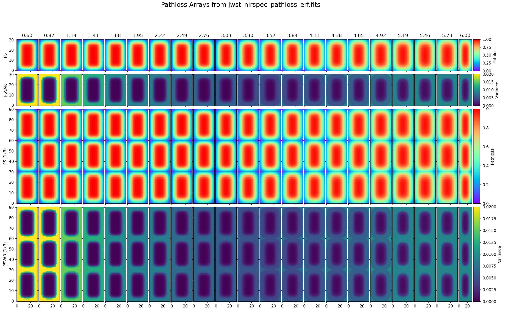
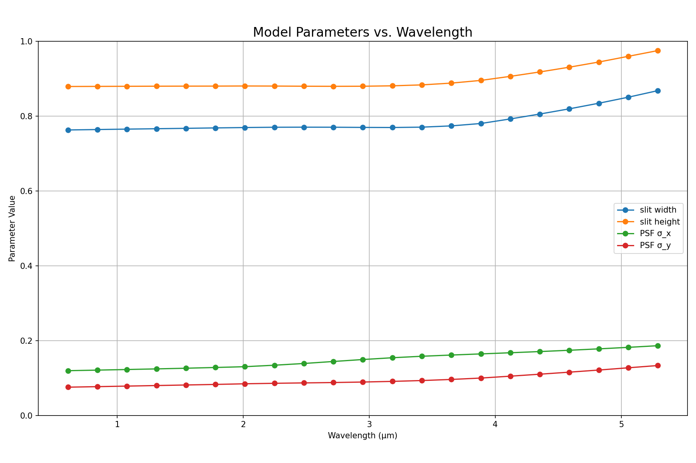
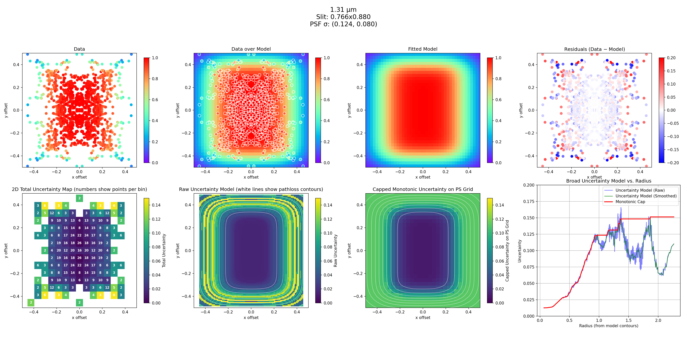

# JWST NIRSpec Pathloss Model

This script models the pathloss for JWST NIRSpec MOS (multi-object spectrograph). The pathloss is the fraction of light from a point source that is lost due to the finite size of the spectrograph slit.

NIRSpec MOS pathlosses were measured by Elena Manjavacas (STScI). This script interpolates those measurements onto a regular grid using the error function (erf), which is derived from integrating a Gaussian Point Spread Function (PSF) over a rectangular slit. It then also calculates uncertainties.

Code and plots are provided here, with
[additional plots available on Box](https://stsci.box.com/v/NIRSpec-MOS-pathloss-interp).



## Features

*   **Physical Modeling:** Implements a 2D physical model for PSF throughput through a rectangular slit using the error function.
*   **Data Fitting:** Fits the model to observational data to determine key parameters like slit dimensions and PSF size as a function of wavelength.
*   **Uncertainty Analysis:** Provides a detailed uncertainty analysis, including the calculation of residuals, 2D scatter, and a smoothed, monotonic uncertainty model.
*   **Data Visualization:** Generates a comprehensive set of plots to visualize the data, model fits, residuals, and uncertainty characterization.
*   **FITS File Generation:** Creates and updates FITS files with the modeled pathloss and its associated variance, suitable for use in astronomical data analysis pipelines.
*   **Command-Line Interface:** Offers a flexible command-line interface to control the script's execution, including plotting, prediction, and FITS file updates.

## Installation

This script requires the following Python libraries:

*   `numpy`
*   `matplotlib`
*   `astropy`
*   `scipy`

You can install these dependencies using pip:

```bash
pip install numpy matplotlib astropy scipy
```

## Usage

The script `model_pathloss_data.py` can be run from the command line with various options.

### Basic Execution

To run the full analysis, including fitting the model to the data and generating all plots, simply run the script without any arguments:

```bash
python model_pathloss_data.py
```

This will create a new directory (e.g., `plots_throughput_model_sparse1`) containing all the output plots.

### Command-Line Arguments

*   `--plot-arrays <FITS_FILE>`: Plot the pathloss arrays from a given FITS file.
    ```bash
    python model_pathloss_data.py --plot-arrays jwst_nirspec_pathloss_erf.fits
    ```

*   `--summary-only`: Only generate the final summary plots (parameters vs. wavelength and scatter summary).
    ```bash
    python model_pathloss_data.py --summary-only
    ```

*   `--predict-wavelength <WAVELENGTH>`: Predict the pathloss for a specific wavelength and save it to a FITS file.
    ```bash
    python model_pathloss_data.py --predict-wavelength 2.5 --output-fits prediction.fits
    ```

*   `--update-fits`: Update the `jwst_nirspec_pathloss_0005.fits` file with the model-derived pathloss and variance, saving the result to `jwst_nirspec_pathloss_erf.fits`.
    ```bash
    python model_pathloss_data.py --update-fits
    ```

*   `--fit-slit-dims-once`: Fit the slit dimensions for the first wavelength only and keep them constant for all other wavelengths.
    ```bash
    python model_pathloss_data.py --fit-slit-dims-once
    ```

*   `--no-scatter`: Disable the scatter analysis and related plots.
    ```bash
    python model_pathloss_data.py --no-scatter
    ```

*   `--radius-bin-width <WIDTH>`: Set the bin width for smoothing the uncertainty vs. radius plot.
    ```bash
    python model_pathloss_data.py --radius-bin-width 0.02
    ```

## File Descriptions

*   `model_pathloss_data.py`: The main Python script for modeling, fitting, and plotting the NIRSpec pathloss data.
*   `jwst_nirspec_pathloss_erf.fits`: The output FITS file containing the modeled pathloss and variance arrays.
*   `jwst_nirspec_pathloss_erf_arrays_plot_by_wavelength.png`: A plot showing the pathloss and variance arrays from the FITS file for each wavelength.
*   `../data/flip_xy_slitlosses/`: The directory assumed to contain the input slit-loss data files (not included in this directory).

## Method and Calculations

This script implements a physical model for the throughput of a point source through a rectangular aperture, such as the NIRSpec micro-shutter assembly. The model assumes a Gaussian Point Spread Function (PSF) for the source. The throughput is calculated by integrating the 2D Gaussian PSF over the area of the rectangular slit.

The (x, y) coordinates represent the offset of the center of the point source from the center of the slit, in arcseconds. The data used for fitting typically covers a range of approximately -0.5 to +0.5 arcseconds in both x and y.

Since the 2D Gaussian is separable, the total 2D throughput `T(x, y)` is the product of two independent 1D integrals. Each 1D integral is calculated analytically using the error function (`erf`), which is the integral of a Gaussian distribution.

The 1D throughput in the x-direction is given by:  
`T_x(x) = 0.5 * [erf((w_x/2 - x) / (sqrt(2) * sigma_x)) - erf((-w_x/2 - x) / (sqrt(2) * sigma_x))]`

Similarly, the 1D throughput in the y-direction is:  
`T_y(y) = 0.5 * [erf((w_y/2 - y) / (sqrt(2) * sigma_y)) - erf((-w_y/2 - y) / (sqrt(2) * sigma_y))]`

The total 2D throughput is then:
`T(x, y) = T_x(x) * T_y(y)`

The model has four free parameters which are fit to the data for each wavelength:
*   `w_x`: The full width of the slit in the x-direction (`slit_w`).
*   `w_y`: The full height of the slit in the y-direction (`slit_h`).
*   `sigma_x`: The standard deviation of the Gaussian PSF in the x-direction (`psf_sx`).
*   `sigma_y`: The standard deviation of the Gaussian PSF in the y-direction (`psf_sy`).

The model parameters are fit to observational data of stellar path-loss measurements at various offsets from the center of the slit. The fitting is performed for each wavelength independently using a least-squares optimization (`scipy.optimize.least_squares`). The script also includes a detailed uncertainty analysis. The residuals between the model and the data are used to create a 2D uncertainty map. A key feature of this analysis is the creation of a monotonic uncertainty model. This model enforces the physically motivated assumption that the uncertainty in the path-loss correction increases monotonically with distance from the center of the slit. The final products are model-generated path-loss and variance arrays, which can be saved to a FITS file. The script can also interpolate the fitted model parameters to any wavelength, providing a continuous model of the path-loss across the NIRSpec wavelength range.



Below is the model fitting and uncertainties calculation for 1.31µm:



## Outputs

The script generates two main types of outputs:

### Plots

A number of plots are generated to visualize the results of the analysis. These are saved in a new directory created each time the script is run (e.g., `plots_throughput_model_sparse1`).

*   **Throughput Fit Plots:** For each wavelength, a multi-panel plot showing the input data, the fitted model, the residuals (data - model), and various uncertainty plots.
*   **Parameter vs. Wavelength Plot:** A summary plot showing how the fitted model parameters (`slit_w`, `slit_h`, `psf_sx`, `psf_sy`) vary with wavelength.
*   **Scatter Summary Plot:** A summary plot showing the RMS scatter of the residuals as a function of the model pathloss for all wavelengths.
*   **FITS Array Plots:** If the `--plot-arrays` option is used, a plot showing the contents of the `PS` and `PSVAR` extensions of the input FITS file.

### FITS Files

*   `jwst_nirspec_pathloss_erf.fits`: This file is the primary data product. It is a multi-extension FITS file that contains the modeled pathloss (`PS` extension) and the corresponding variance (`PSVAR` extension) on a regular grid for a range of wavelengths. This file is created when using the `--update-fits` option.
*   `pathloss_prediction.fits` (or other specified name): A single-extension FITS file containing the predicted pathloss on a grid for a single wavelength, created when using the `--predict-wavelength` option.
